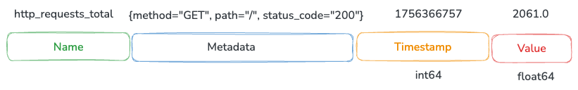
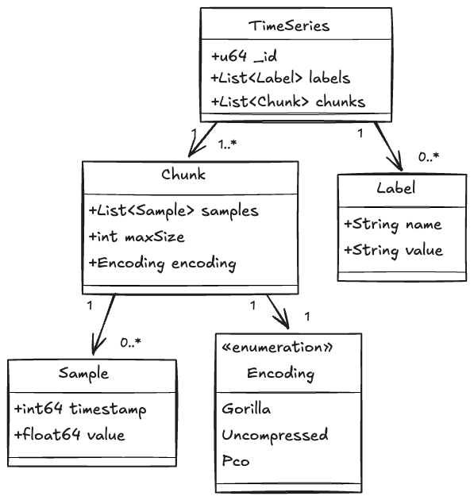
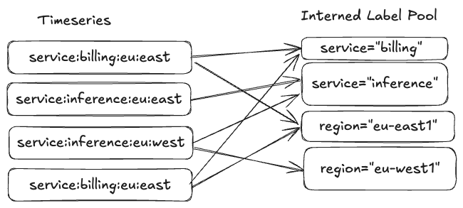
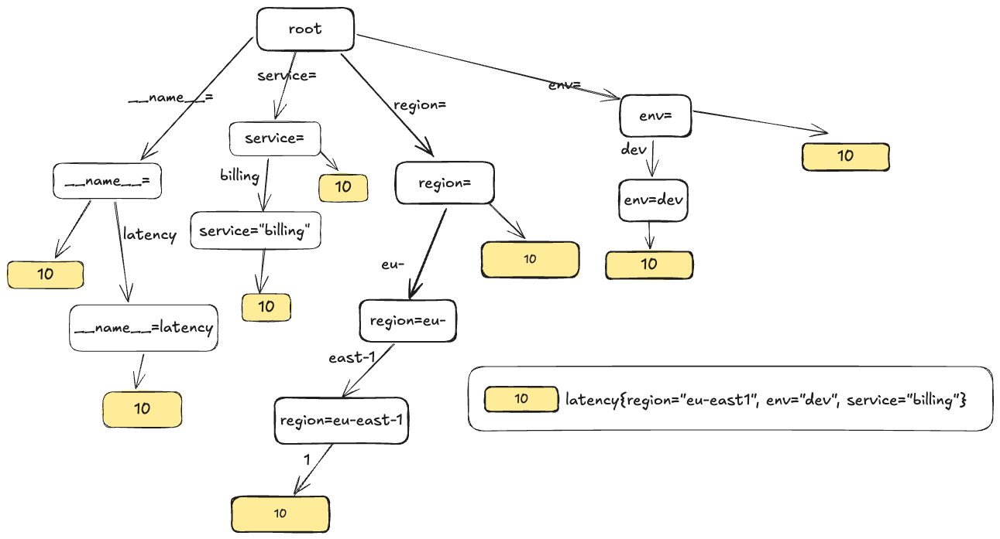
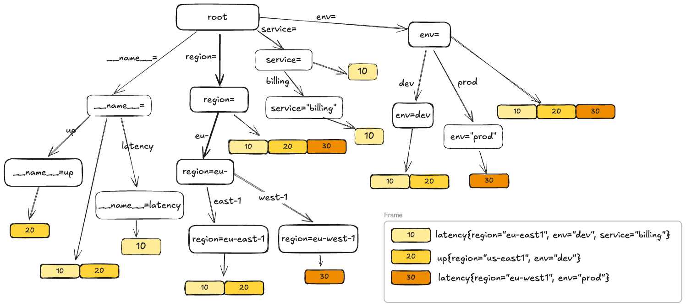
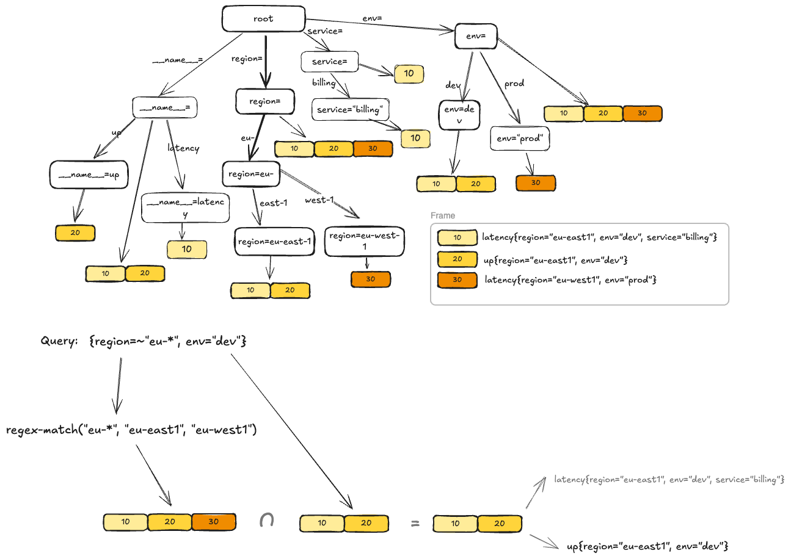
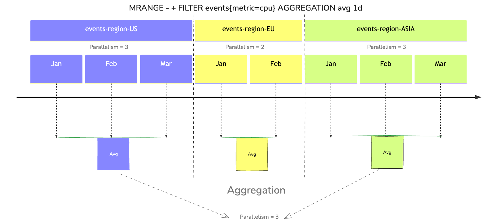

# keyspace-2025

---
## Who Am I?

I’m Clayton Collie, an independent developer and long time open-source contributor, now a contributor to the Valkey Project.

## What Is ValkeyTimeSeries?

ValkeyTimeSeries is a high-performance, scalable time series database built as a module for ValkeyDB. It is designed to handle large volumes of time-stamped data with low latency and high throughput, making it ideal for applications such as monitoring, IoT, and real-time analytics.

---
## What is a Timeseries Database?
A timeseries database is a type of database optimized for storing and querying data that is indexed by time. This type of database is particularly useful for applications that generate large amounts of time-stamped data, such as monitoring systems, financial applications, and IoT devices.

A timeseries measures `metrics`. A metric is an observation of some value at some point in time. Metrics consist of the following parts:



* Name - The name of the metric describes what this metric measures.
* Metadata - Information about the metric represented as label-value pairs.
* Value - The observation itself.
* Timestamp - The time the observation was recorded.
A combination of a metric name and its metadata defines a time series. In the real world, one could expect millions of unique time series to be processed and stored in a TSDB for a moderate load.

### You'll find TSDBs at the heart of:

* Monitoring & Observability: Server metrics, application performance monitoring (APM), network data.

* IoT & Sensor Data: Smart home devices, industrial sensor networks, vehicle telemetry.

* Financial Analytics: Stock ticker prices, trading volumes, algorithmic trading.

* Application Analytics: User activity events, clickstreams, ad performance tracking.

* Environmental Data: Weather stations, smart agriculture, energy grid management.


---
## Improvements over RedisTimeseries.
ValkeyTimeSeries is a intended as a drop-in replacement for RedisTimeseries, with a focus on performance, scalability, and usability. Here are some of the key improvements:

### Active Expiration

We support active pruning of expired samples in the background. RedisTimeseries prunes lazily on query.

### Multi-Db Support

Timeseries can be created in multiple dbs, with proper query isolation. This includes proper support for SWAPDB.

### Rounding

support for rounding sample values to specified precision. This is enforced for all samples in a time series.

### Dependent Compactions

support for creating compaction rules based on other compactions.

```
redis> TS.CREATE visitor:count:1m
OK
redis> TS.CREATE visitors:count:1h
OK
redis> TS.CREATE visitors:count:1d
OK

redis> TS.CREATERULE visitor:count:1m visitors:count:1h AGGREGATION sum 1h
OK
redis> TS.CREATERULE visitors:count:1h visitors:count:1d AGGREGATION sum 1d
OK
```

### Compaction Policy Filters

Default compactions can specify a filter expression to select which keys they are applied to. For example, certain aggregations (e.g. `min`) are appropriate to gauges and not counters, whereas in RedisTimeseries the defaults are applied to all rules.

```bash
redis> CONFIG SET ts-compaction-policy avg:2h:10d|^metrics:memory:*;sum:60s:1h:5s|^metrics:cpu:*
OK
```

### Query Filter Enhancements

We support full Prometheus style series selectors (essentially an [Instant Vector](https://promlabs.com/blog/2020/07/02/selecting-data-in-promql/#instant-vector-selectors)) in addition to the RedisTimeseries filter syntax. For example:

- `TS.QUERYINDEX latency{region=~"us-west-*",service="inference"}` will return all series recording latency for the inference service in all us west regions.
- `TS.MRANGE -6hrs -3hrs request_error_total{service="inference", status="400", path="/auth", region=~"us-east-?"}` will return the total count of 400 errors for the auth endpoint, recorded between 3 and 6 hours ago for the inference service across all east regions.
- `TS.QUERYINDEX queue{job="app1",env="prod" or job="app2",env="dev"}` will return the series with the `{job="app1",env="prod"}` or `{job="app2",env="dev"}` labels.

We also support`"OR"` matching for Prometheus style selectors. For example:

- `TS.QUERYINDEX queue{job="app1",env="prod" or job="app2",env="dev"}` will return the series with the `{job="app1",env="prod"}` or `{job="app2",env="dev"}` labels.

### Metadata Commands

Support for returning cross-series index metadata (label names, label values, cardinality)

e.g. To get the top 10 label names for series matching a filter:
```bash
TS.LABELNAMES TS.LABELNAMES LIMIT 10 FILTER up process_start_time_seconds{job="prometheus"}

1) "__name__",
2) "instance",
3) "job"
```

### Developer Ergonomics

support for relative timestamps in queries, e.g. `TS.RANGE key -6hrs -3hrs`, unit suffixes (e.g. `1s`, `3mb`, `20K`), and a more expressive query language.

### Joins

ValkeyTimeSeries supports joins between time series objects, including INNER, OUTER, and ASOF joins

---
## Timeseries

A TimeSeries represents the main time series data structure. It is the top-level component and owns the Chunk (data) and Labels components (metadata).




Chunks: A list of Chunk objects, representing the time series data divided into 
ordered, non-overlapping time intervals. Each chunk consists of multiple samples, which consists of 
a 64bit timestamp and a 64bit float.

Labels: A list of Label objects, providing metadata about the time series. Each label consists of a name-value pair.

---
## Indexes
ValkeyTimeseries uses an inverted index to map label-value pairs to the corresponding time series. This allows for efficient querying and retrieval of time series based on their labels.


---
## Labels

A Label represents a key-value pair used to annotate time series data. 
Labels provide metadata that helps categorize and identify time series, making it easier to query and analyze the data.

### String Interning



Instead of storing multiple identical copies of the same string in memory (e.g., a common label key or value like "instance" or "production"), string interning ensures that only a single, unique copy of each string exists. All occurrences of that string then refer to this single, shared instance in memory.

### Dramatic Memory Reduction

String interning in time series databases can achieve remarkable compression ratios. For typical workloads:

- **Label Names**: Often only a small number of unique label names over even thousands or millions of series
- **Label Values**: Common values like environment names, service names, and region identifiers are heavily repeated

In practice, string interning can reduce memory usage by:

- **50-90% reduction** in label storage overhead
--- 
## Indexes
An Index is a data structure that maps labels to the corresponding time series.
It allows for efficient querying and retrieval of time series based on their labels.


**TimeSeries Indexing**

A time series is uniquely identified by an opaque unsigned 64bit int. Each label-value pair is mapped to the id of each series which contains that attribute. The mapping is implemented as an [Adaptive Radix Tree (ART)](https://db.in.tum.de/~leis/papers/ART.pdf) (pdf), where each node is a 64bit [Roaring BitMap](https://roaringbitmap.org/about/).

**TimeSeries Indexing Scheme**

The ART is used to index time series based on their labels. For each unique combination of label and value, we create a key by concatenating the label and value strings. E.g. "region=us-west-2". This key is used to manage a 64bit roaring bitmap that contains the ids of all time series that have that label-value pair. To retrieve ids for a given list of label-value pairs, we look up the keys in the ART and perform an intersection. The ART natively supports range queries, so we can efficiently find keys with a given prefix. For example, we can search on the prefix "region=" to find all time series with a label "region".

We also maintain a mapping from id to a valkey key to retrieve the time series after querying.

---
## Indexing Example



---


---
Query Example



---
## Multi-Range Parallelization

ValkeyTimeseries exhibits superior performance on multi-core systems by parallelizing operations across multiple threads. This is particularly beneficial for operations that 
involve scanning or processing large numbers of time series and chunks, such as range queries or aggregations.

As a demonstration, let's consider the following scenario:
We have event data stored in 3 timeseries representing 3 regions. Assume also that the
chunk sizes allow storing samples for one month each. Now suppose we want to get a quarterly
average of the values across all regions. This involves scanning all 3 series and aggregating the data.
By default chunks are compressed, so we need to decompress them before processing.

In ValkeyTimeseries, we are able to parallelize the decompression and aggregation across multiple threads,
leading to significant performance improvements.



---
## Faster Ingestion with Input Batching

ValkeyTimeseries supports batching of input samples for the TS.MADD command. 
This allows clients to send multiple samples in a single request, reducing the overhead of 
network round-trips and improving throughput.

As a refresher, we can add multiple samples at once using TS.MADD:

```
TS.MADD key1 1609459200000 42.0 key2 1609459200000 36.5 key1 1609459260000 43.0
```

When a batch of samples is received, ValkeyTimeseries processes them in parallel across multiple threads.
The sample merge capability in `TimeSeries` provides several efficiency measures:

- **Chunk-aware processing**: Samples are grouped by the chunks they belong to
- **Parallel chunk operations**: For compressed chunks, processes multiple chunks simultaneously
- **Bulk operations**: Uses a merge operation instead of individual `add` calls to reduce per-sample overhead

These measures makes MADD significantly more efficient than individual `TS.ADD` operations, especially when dealing with 
multiple series or large batches of samples.

---
## Downsampling Like a Pro

ValkeyTimeseries supports automatic downsampling of time series data through compaction rules.
This allows users to create lower-resolution versions of their time series for long-term storage and analysis.  

We support a variety of aggregation functions, including sum, avg, min, max, count, first, last, and std.
Compaction rules can be created with filters to apply them only to specific series based on their labels.
Compaction rules can also be dependent on other compaction rules, allowing for multi-level downsampling.

```
redis> TS.CREATE temperature:1m
OK
redis> TS.CREATE temperature:1h
OK
redis> TS.CREATE temperature:1d
OK
redis> TS.CREATERULE temperature:1m temperature:1h AGGREGATION avg 1h
OK
redis> TS.CREATERULE temperature:1h temperature:1d AGGREGATION avg 1d
OK
```

Upon a change in the parent timeseries, compaction rules are processed in parallel by worker threads, ensuring that downsampling 
has minimal impact on real-time data ingestion and querying.