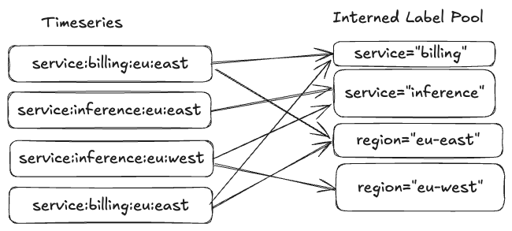

# keyspace-2025

---
## Who Am I?

I’m Clayton Collie, an independent developer and long time open-source contributor, now a contributor to the Valkey Project.

## What Is ValkeyTimeSeries?

ValkeyTimeSeries is a high-performance, scalable time series database built as a module for Valkey. It is designed to handle large volumes of time-stamped data with low latency and high throughput, making it ideal for applications such as monitoring, IoT, and real-time analytics.

---
## What is a Timeseries Database?
A timeseries database is a type of database optimized for storing and querying data that is indexed by time. 

A timeseries measures `metrics`. A metric is an observation of some value at some point in time. Metrics consist of the following parts:


* Name - The name of the metric describes what this metric measures.
* Metadata - Information about the metric represented as label-value pairs.
* Value - The observation itself.
* Timestamp - The time the observation was recorded.

A combination of a metric name and its metadata defines a time series. 

### You'll find TSDBs at the heart of:

* Monitoring & Observability: Server metrics, application performance monitoring (APM), network data.

* IoT & Sensor Data: Smart home devices, industrial sensor networks, vehicle telemetry.

* Financial Analytics: Stock ticker prices, trading volumes, algorithmic trading.

* Application Analytics: User activity events, clickstreams, ad performance tracking.

* Environmental Data: Weather stations, smart agriculture, energy grid management.

___
## A Quick Introduction to ValkeyTimeseries

Let's walk through a practical example. Imagine we have a network of temperature sensors in different rooms of a building. We want to store their readings in RedisTimeSeries.

### Adding Data
First, we need to create a time series for each sensor. We can do this when we add the first data point. The `TS.ADD` command adds a new sample to a time series. If the time series does not exist, it will be created automatically.
Let's add a temperature reading for a sensor in the living room.
``` redis
TS.ADD temperature:living_room * 20.5
```
Let's break down this command:
- `temperature:living_room`: This is the key, or name, of our time series.
- `*`: This tells ValkeyTimeSeries to use the current server time as the timestamp for this sample. You can also provide a specific timestamp in milliseconds.
- `20.5`: This is the value of our sample, in this case, the temperature in Celsius.

After 10 minutes, we add another reading:
``` redis
TS.ADD temperature:laundry_room * 21.5
```
We can also add metadata to our time series using labels. This is useful for querying and filtering. Let's create another time series for a sensor in the bedroom and add labels to it.
``` redis
TS.ADD temperature:bedroom * 22.1 LABELS room bedroom building main
```
Here, we've added two labels: `room` with the value `bedroom`, and `building` with the value `main`.
For efficiency, you can add multiple samples to multiple time series at once using the `TS.MADD` command.
``` redis
TS.MADD temperature:living_room * 25.8 temperature:bedroom * 22.2
```
---
## A Quick Introduction to ValkeyTimeseries

### Querying Data
Now that we have some data, let's query it. The simplest way to retrieve data from a single time series is with the `TS.RANGE` command.
To get all the data from the `temperature:living_room` series, we can use:
``` redis
TS.RANGE temperature:living_room - +
```
- `-`: Represents the earliest possible timestamp.
- `+`: Represents the latest possible timestamp.

The output will be a list of `[timestamp, value]` pairs.
You can also specify a time range. For example, to get the last hour of data:

``` redis
TS.RANGE temperature:living_room -1hr + AGGREGATION avg 3600000
```
This would give us the last 10 entries from the last hour, with an aggregation of the average.

To retrieve the latest sample from a time series, you can use the `TS.GET` command:
``` redis
TS.GET temperature:living_room
```

---
## A Quick Introduction to ValkeyTimeseries

### Querying with Labels

Labels allow us to query data from multiple time series that share common characteristics. You can use `TS.MRANGE` to query across multiple series based on a filter.
For example, to get the readings from all rooms in the `main` building between January 1 and 2 of 2025 (GMT):

``` redis
TS.MRANGE 1735689600 1735776000 FILTER building=main
```

This will return the data from all time series that have the label `building=main`.

---
## A Quick Introduction to ValkeyTimeseries

### Deleting Data
If you need to delete a range of samples, you can use the `TS.DEL` command.

``` redis
TS.DEL temperature:living_room -1hr *
```

This command deletes all samples from the `temperature:living_room` for the last hour.

---
## A Quick Introduction to ValkeyTimeseries

### Downsampling and Compaction
Downsampling allows users to create lower-resolution versions of time series data for long-term storage and analysis.  
For example, to create a downsampled series that stores the average temperature every hour:
``` redis
TS.CREATERULE temperature:living_room temperature:living_room:1h AGGREGATION avg 3600000
```
Now, every time a new sample is added to `temperature:living_room`, the average for
the last hour will be automatically calculated and stored in `temperature:living_room:1h`.

We can query the downsampled series just like any other time series:
``` redis
TS.RANGE temperature:living_room:1h - +
```
---
## Improvements over RedisTimeseries
ValkeyTimeSeries is intended as a drop-in replacement for RedisTimeseries, with a focus on performance, scalability, and usability. Here are some of the key improvements:

### Active Expiration

We support active pruning of expired samples in the background. RedisTimeseries prunes lazily on query.

### Multi-Db Support

Timeseries can be created in multiple dbs, with proper query isolation. This includes proper support for SWAPDB.

### Rounding

Support for rounding sample values to specified precision. This is enforced for all samples in a time series.

### Dependent Compactions

Support for creating compaction rules based on other compactions.

``` redis
redis> TS.CREATE visitor:count:1m
OK
redis> TS.CREATE visitors:count:1h
OK
redis> TS.CREATE visitors:count:1d
OK

redis> TS.CREATERULE visitors:count:1m visitors:count:1h AGGREGATION sum 1h
OK
redis> TS.CREATERULE visitors:count:1h visitors:count:1d AGGREGATION sum 1d
OK
```
---
## Improvements over RedisTimeseries
### Query Filter Enhancements

We support full Prometheus style series selectors (essentially an [Instant Vector](https://promlabs.com/blog/2020/07/02/selecting-data-in-promql/#instant-vector-selectors)) in addition to the RedisTimeseries filter syntax. For example:

```redis
TS.QUERYINDEX latency{region=~"us-west-*",service="inference"}
```
will return all series recording latency for the inference service in all us west regions.

```redis
TS.QUERYINDEX -6hrs -3hrs request_error_total{service="inference", status="400", path="/auth", region=~"us-east-?"}
```
 will return the total count of 400 errors for the auth endpoint, recorded between 3 and 6 hours ago for the inference service across all east regions.

```redis
TS.QUERYINDEX queue{job="app1",env="prod" or job="app2",env="dev"}
```
will return the series with the `{job="app1",env="prod"}` or `{job="app2",env="dev"}` labels.

We also support `"OR"` matching for Prometheus style selectors. For example:

```redis
TS.QUERYINDEX queue{job="app1",env="prod" or job="app2",env="dev"}
```
will return the series with the `{job="app1",env="prod"}` or `{job="app2",env="dev"}` labels.

### Compaction Policy Filters

Default compactions can specify a filter expression to select which keys they are applied to. For example, certain aggregations (e.g. `min`) are appropriate to gauges and not counters, whereas in RedisTimeseries the defaults are applied to all rules.

```redis
redis> CONFIG SET ts-compaction-policy avg:2h:10d|^metrics:memory:*;sum:60s:1h:5s|^metrics:cpu:*
OK
```
---
## Improvements over RedisTimeseries

### Metadata Commands

We support returning cross-series index metadata (label names, label values, cardinality)

For example, to get the top 10 label names for series matching a filter:
```
> TS.LABELNAMES LIMIT 10 FILTER up process_start_time_seconds{job="prometheus"}

1) "__name__",
2) "instance",
3) "job"
```

### Developer Ergonomics

Support for relative timestamps in queries, e.g. `TS.RANGE key -6hrs -3hrs`, unit suffixes (e.g. `1s`, `3mb`, `20K`), and a more expressive query language.

### Joins

ValkeyTimeSeries supports joins between time series objects, including INNER, OUTER, and ASOF joins

---
## The Timeseries Structure

A TimeSeries represents the main time series data structure. It is the top-level component and owns the Chunk (data) and Labels components (metadata).


**Chunks**: A list of Chunk objects, representing the time series data divided into 
ordered, non-overlapping time intervals. Each chunk consists of multiple samples, which consist of 
a 64bit timestamp and a 64bit float.

**Labels**: A list of Label objects, providing metadata about the time series. Each label consists of a name-value pair.

---
## Labels

A Label represents a key-value pair used to annotate time series data, making it easier to query and analyze the data.

### String Interning



Instead of storing multiple identical label-value pairs in memory, a single copy of each unique pair is shared
among all timeseries with that combination.

For typical workloads, as db would contain:

- **Label Names**: Often only a small number of unique label names over even thousands or millions of series
- **Label Values**: Common values like environment names, service names, and region identifiers are heavily repeated

In practice, string interning can reduce memory usage by:

- **50-90% reduction** in label storage overhead
--- 
## Timeseries Indexes

ValkeyTimeseries uses an inverted index to map label-value pairs to their corresponding time series. This allows for efficient querying and retrieval of time series based on their labels.


---
## TimeSeries Indexing

A time series is uniquely identified by an opaque unsigned 64bit int. Each label-value pair is mapped to the id of each series which contains that attribute. The mapping is implemented as an [Adaptive Radix Tree (ART)](https://db.in.tum.de/~leis/papers/ART.pdf) (pdf), where each node is a 64bit [Roaring BitMap](https://roaringbitmap.org/about/).

#### TimeSeries Indexing Scheme

The ART is used to index time series based on their labels. For each unique combination of label and value, we create a key by concatenating the label and value strings. E.g. "region=us-west-2". This key is used to manage a 64bit roaring bitmap that contains the ids of all time series that have that label-value pair. To retrieve ids for a given list of label-value pairs, we look up the keys in the ART and perform an intersection. The ART natively supports range queries, so we can efficiently find keys with a given prefix. For example, we can search on the prefix "region=" to find all time series with a label "region".

We also maintain a mapping from id to a valkey key to retrieve the time series after querying.

---
## TimeSeries Indexing

### Indexing Example


---
## TimeSeries Indexing

### Indexing Multiple Series


---
## TimeSeries Indexing

### Query Example


---
## Performance
### Query Parallelization

ValkeyTimeseries parallelizes query operations across multiple threads. This is particularly beneficial for operations that 
involve scanning or processing large numbers of time series and chunks, such as range queries or aggregations.

As a demonstration, let's consider the following scenario:

We have event data stored in 3 timeseries representing 3 regions in chunks of 1-month each. Now suppose we want to get a 
quarterly average of the values across all regions. This involves scanning all 3 series and aggregating the data.
By default chunks are compressed, so we need to decompress them before processing.

In ValkeyTimeseries, we are able to parallelize the decompression and aggregation across multiple threads,
leading to significant performance improvements.


---
## Performance
### Faster Ingestion with Input Batching

ValkeyTimeseries supports batching of input samples for the TS.MADD command. 
This allows clients to send multiple samples in a single request, reducing the overhead of 
network round-trips and improving throughput.

As a reminder, you can add multiple samples at once using TS.MADD:

```
TS.MADD key1 1609459200000 42.0 key2 1609459200000 36.5 key1 1609459260000 43.0
```

When a batch of samples is received, ValkeyTimeseries processes them in parallel across multiple threads.
The sample merge capability in `TimeSeries` provides several efficiency measures:

- **Chunk-aware processing**: Samples are grouped by the chunks they belong to
- **Parallel chunk operations**: For compressed chunks, processes multiple chunks simultaneously
- **Bulk operations**: Uses a merge operation instead of individual `add` calls to reduce per-sample overhead

These measures make MADD significantly more efficient than individual `TS.ADD` operations, especially when dealing with 
multiple series or large batches of samples.

---
## Performance
## Downsampling Efficiency

When the parent time series changes, compaction rules are processed in parallel by worker threads, 
ensuring that downsampling has minimal impact on real-time data ingestion and querying.

---
## Repository

repo: https://github.com/ccollie/valkey-timeseries

rfc: https://github.com/ccollie/valkey-rfc/blob/main/TimeSeries.md